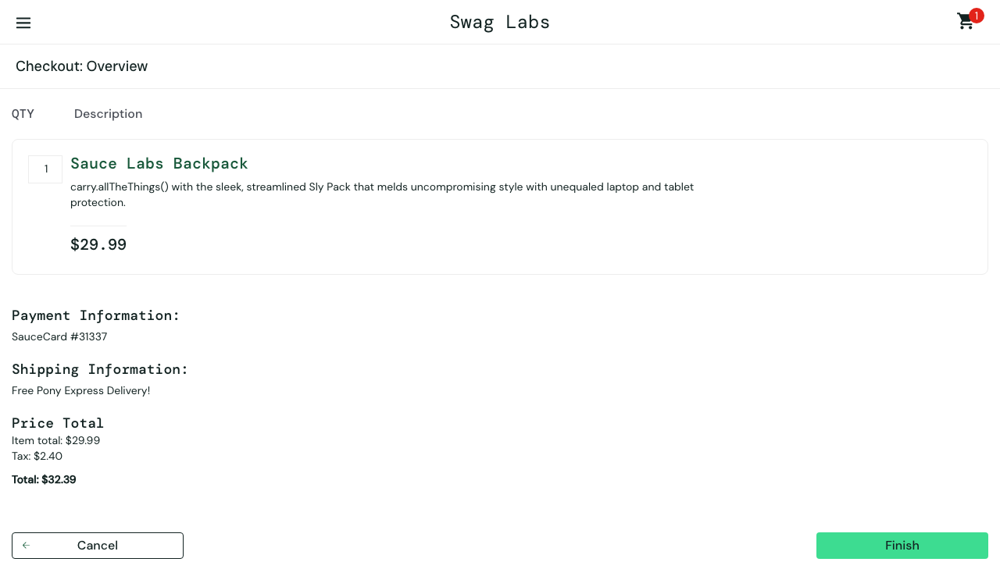

# Computer-Use Automation System

A backend integration layer that lets an AI agent operate a legacy back-office UI with no API:
an LLM ("computer use") drives a real browser to discover how to accomplish a goal, that run is
recorded as a typed, versioned, reusable **capability artifact**, and the artifact is replayed
**deterministically** — no model in the loop — as the production execution path. A resumable
human-in-the-loop handoff lets an operator take over the same live session when the system can't
safely proceed on its own.

<p align="center">
  
  <br/><em>The actual final screenshot from a real, live discovery run &mdash; see <a href="evidence/discovery-run/README.md">evidence/discovery-run/</a>.</em>
</p>

Built for the interface.ai take-home (see the design write-up at [`/REPORT.md`](./REPORT.md) for
architecture, trade-offs, and what was cut). Target application: [saucedemo.com](https://www.saucedemo.com)
(a public e-commerce demo site used as a stand-in for a bank/credit-union back-office app).

## Status at a glance

Every core requirement in the brief (§3) is implemented, tested, and demonstrated with real
evidence in [`/evidence/`](./evidence/) — including a genuine, live, LLM-driven discovery run
against `claude-sonnet-4-5-20250929` (see
[`evidence/discovery-run/`](./evidence/discovery-run/README.md), which also documents a real
secret-redaction bug that run caught and the fix for it). The agent loop, artifact schema,
deterministic replay with full error-taxonomy handling, safety guardrails, evidence capture, and
the HITL escalation/handoff mechanism are all built and covered by 75 automated tests (unit +
integration against a real browser).

## Requirements

- Node.js `>=18.18`
- An [Anthropic API key](https://console.anthropic.com/) — **only** needed for `npm run discover`.
  `npm run replay` never calls an LLM and works with zero credentials.

## 1. Setup

```bash
npm install                # also runs `playwright install chromium` via postinstall
cp .env.example .env       # then, if you want to run `discover`, add your ANTHROPIC_API_KEY
```

`.env` variables (see `src/config/env.ts` for the full, validated schema):

| Variable | Required for | Default |
|---|---|---|
| `ANTHROPIC_API_KEY` | `discover` only | — (unset is fine for `replay`) |
| `ANTHROPIC_MODEL` | `discover` | `claude-sonnet-4-5-20250929` |
| `PLAYWRIGHT_HEADLESS` | both | `false` (headed, so a HITL operator can watch/take over) |
| `TARGET_BASE_URL` | both | `https://www.saucedemo.com` |
| `LOG_LEVEL` | both | `minimal` |

Secrets never leave `.env` — it's gitignored, and application-level secrets (login credentials
passed as `--param`) are separately redacted from every log and artifact via
`src/safety/redaction.ts` regardless of how `LOG_LEVEL` is set.

## 2. Run without live services (no API key, no live LLM)

There's no generic `npm run dev` here — this is two CLI tools, not a server, and each one needs
arguments to mean anything (`discover` needs a goal + API key; `replay` needs a capability id +
params). The closest thing to "just run it":

```bash
npm run demo
```

This is `npm run replay` with one known-good invocation's arguments baked in — no flags, no API
key, just a real (headed by default) browser driving the real live saucedemo.com through the
`saucedemo.add_item_and_checkout` artifact already checked into `tests/fixtures/`. It's the exact
command that produced `evidence/replay-runs/success/`.

For anything beyond the one demo case, use `npm run replay` directly — it's the production
execution path (§3.3) and has no LLM dependency at all:

```bash
npm run replay -- \
  --capability-id saucedemo.add_item_and_checkout \
  --artifacts-dir tests/fixtures \
  --param username=standard_user \
  --param password=secret_sauce --redact password \
  --param firstName=Ada --param lastName=Lovelace --param postalCode=94107 \
  --headless
```

Two more variations
(see [`evidence/README.md`](./evidence/README.md) for the full breakdown) demonstrate the
business-outcome branches of the replay result taxonomy:

```bash
# Business outcome: blank postal code -> the app's own validation error, reported not crashed.
npm run replay -- --capability-id saucedemo.add_item_and_checkout --artifacts-dir tests/fixtures \
  --param username=standard_user --param password=secret_sauce --redact password \
  --param firstName=Ada --param lastName=Lovelace --param postalCode= --headless

# Business outcome: a known locked-out test account.
npm run replay -- --capability-id saucedemo.add_item_and_checkout --artifacts-dir tests/fixtures \
  --param username=locked_out_user --param password=secret_sauce --redact password \
  --param firstName=Ada --param lastName=Lovelace --param postalCode=94107 --headless
```

Run `npm run replay -- --help` for the full option list (`--version`, `--run-id`,
`--evidence-dir`, etc.). Exit codes are deliberately distinguishable for a calling agent:
`0` success, `1` hard failure, `2` caller/input error, `3` business outcome.

## 3. Run the discovery agent (requires a live Anthropic API key)

```bash
npm run discover -- \
  --goal "Log in, add the Sauce Labs Backpack to the cart, proceed to checkout, fill in the shipping information, and reach the checkout overview (review) page showing the order total." \
  --capability-id saucedemo.add_item_and_checkout \
  --param username=standard_user \
  --param password=secret_sauce --redact password \
  --param firstName=Ada --param lastName=Lovelace --param postalCode=94107
```

This launches a real, headed Chromium session, runs Claude through an observe → decide → act
loop against the live site, and — only if the model calls `finish` — records the result as a
`CapabilityArtifact` under `artifacts/`. Evidence (a screenshot per turn + a redacted `log.jsonl`)
is written to `evidence/<runId>/` regardless of outcome. See `npm run discover -- --help` for the
full option list, including `--max-steps`, `--timeout-ms`, and `--dry-run`.

This is exactly the command used to produce [`evidence/discovery-run/`](./evidence/discovery-run/README.md) —
a real completed run, not a mock. Worth reading: that run's first attempt caught a real
secret-redaction bug (the model's own reasoning echoed a raw param value verbatim), which is
documented there along with the fix.

### Demo path end to end (once a key is available)

```bash
# 1. Discover: LLM drives the browser, artifact is saved to artifacts/ on success.
npm run discover -- --goal "..." --capability-id saucedemo.add_item_and_checkout --param ...

# 2. Replay: re-run the SAME artifact deterministically, no LLM involved, with typed params.
npm run replay -- --capability-id saucedemo.add_item_and_checkout --param ...
```

## 4. Human-in-the-loop escalation demo

A `discover` run escalates to a human whenever the agent calls its `escalate` tool, or
automatically after repeated failures/malformed tool calls/dead-ends. When that happens it prints
something like:

```
[discover] waiting for a human operator (up to 600s). In another terminal:
  npm run operator -- --request evidence/<runId>/intervention.json
```

Run that command in a second terminal. The operator CLI attaches to the **same live browser**
(via `chromium.connectOverCDP`, not a fresh session) and offers `url`, `screenshot`, `goto`,
`click`, `resume`, and `abort`. `resume` hands control back to the paused agent loop, which
continues from where it left off. `--no-hitl` on `discover` disables this and aborts immediately
instead, for CI or unattended runs.

This mechanism (not just the CLI wrapper) is proven against a real live browser in
`tests/integration/hitl-handoff.test.ts`, including the full escalate → pause → independent
process attaches → resume → run completes pipeline.

## Testing

```bash
npm run typecheck
npm run lint
npm run test          # 75 tests: unit (fast, mocked) + integration (real browser, real target)
```

Integration tests launch a real Chromium instance against the live saucedemo.com — no network
mocking — so they're slower (~25s) and need a working Playwright install (handled by
`postinstall`).

## Project layout

```
src/
  agent/        Claude-driven observe→decide→act loop, tool schema, prompt building, run trace
  artifact/     CapabilityArtifact schema (Zod), filesystem store, recorder (run trace -> artifact)
  cli/          discover, replay — the two user-facing entrypoints
  config/       .env validation, allowlist policy config
  evidence/     JSONL structured logger, screenshot evidence sink
  hitl/         ControlLock (pause/resume HTTP server), operator CLI, shared types
  replay/       ReplayExecutor (deterministic, no LLM) + the three-way result contract
  safety/       GuardedSurface (allowlist + risky-action gating), redaction
  surface/      Surface abstraction, Playwright-backed WebSurface, locator strategy
scripts/        One-off dev scripts (fixture generation, ad-hoc surface smoke test)
tests/
  unit/         Fast, mocked-dependency tests
  integration/  Real browser, real target — replay executor + HITL handoff
tests/fixtures/ Hand-authored example CapabilityArtifact (see its own provenance note)
artifacts/      Where `discover` saves capability artifacts it records (empty until a real run)
evidence/       Committed demonstration evidence — see evidence/README.md
```

See [`/REPORT.md`](./REPORT.md) for the architecture write-up, artifact schema rationale,
determinism/error-handling design, the multi-tenant/heterogeneity story, the safety model, and
the cut list.
